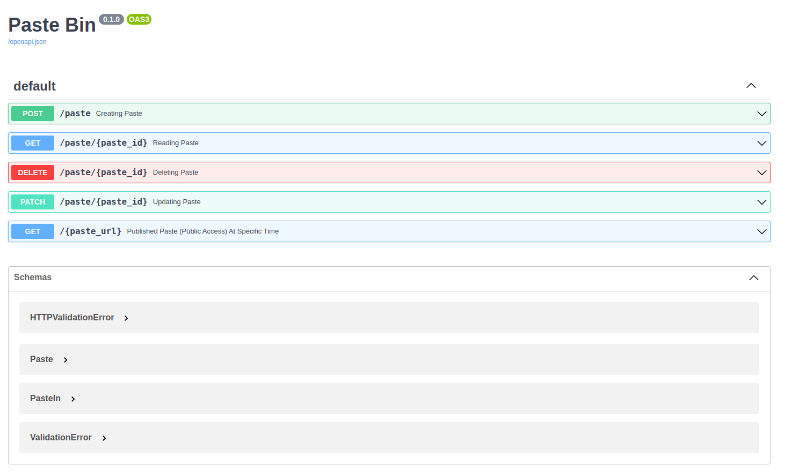

### PasteBinApi

PasteBinApi is a Rest Application which ic clone the PasteBin website

## Project structure:
```
├── .gitgnore
├── alembic.ini
├── docker-compose.yml
├── Dockerfile
├── pastebin.db
├── readme.md
├── requirements.txt
├── app
    ├── cruds.py
    ├── database.py
    ├── main.py
    ├── models.py
    ├── router.py
    ├── schemas.py
    ├── __init__.py
├── tests
    ├── test.db
    ├── test_paste.py
    ├── __init__.py

```

## Architecture

PasteBinApi consist of an Fastapi backend server and a SQLlite databases

## Dependencies

* FastApi: modern, fast, and efficient Python web framework for building APIs 
    
* SQLlite: a lightweight and serverless relational database management system 
* Docker: a platform that allows developers to create, deploy, and run applications in containers
* Pytest: a popular testing framework for Python that allows developers to write simple and easy-to-read tests

## Deploy with docker compose

```shell
docker-compose up
```
## Expected result

Listing containers must show one container running and the port mapping as below:
```
$ docker ps
CONTAINER ID   IMAGE             COMMAND                  CREATED             STATUS          PORTS                                                  NAMES
e980db7bcbb9   pastebinapi_app   "uvicorn app.main:ap…"   About an hour ago   Up 38 minutes   0.0.0.0:8000->8000/tcp, :::8000->8000/tcp              wayan_pastebin
```

After the application starts, navigate to `http://localhost:8000/docs` in your web browser and you should see the following OpenApi pages:



Stop and remove the containers
```
$ docker compose down
```

## Testing
Test Criteria:
- User able to create new paste. if user dont set the expired_at field, it will expired after 6 hours
- User able to update the paste content and expired field
- User able to read a paste. if paste not found return exception 400
- User able to delete the paste. if paste not found return exception 400
- User visit the public url and it return paste content
- if published paste already expired return exception 400
- if published paste not exist return exception 400


To run the test
```
$ docker exec -it wayan_pastebin pytest  
```

## Future Improvement
- Store the paste content into the file to support large content and use file path as value for content path field
- Migrate the database into MySQL/postgreSQL to provide more scalability and better performances
- Create User Account to offer additional premium features
